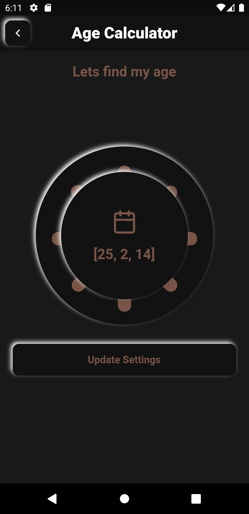

# Age Calculator
 
 Neumorphic UI for age calculation
<table>
<tr>
    <td>Light Theme</td>
     <td>Dark Theme</td>
  </tr>
  <tr>
    <td valign="top"></td>
    <td valign="top"></td>
  </tr>
  <tr>
  </table>
